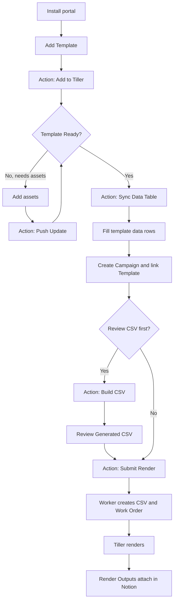
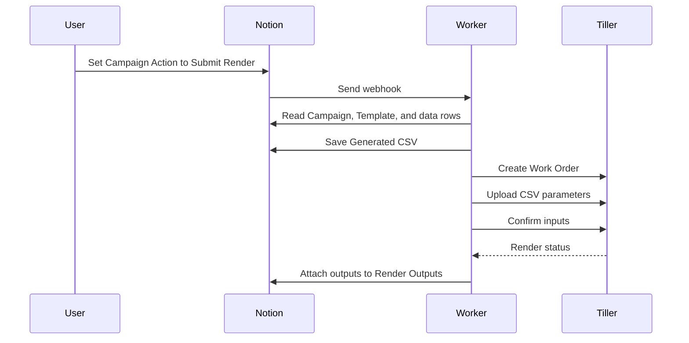

# Tiller Portal Guide

This portal helps a motion designer or studio run Tiller renders from Notion. You manage Templates, Campaigns, Work Orders, and Render Outputs in one place. Terminal is only used for setup and credential updates.

## Start Here

| 1. Set up | 2. Build | 3. Render |
| --- | --- | --- |
| Install the Worker, connect Notion, and save Tiller credentials. | Add a Template, sync its data table, and fill campaign rows. | Submit the Campaign. The Worker builds the CSV, creates the Work Order, and returns outputs. |

## Portal Map

| Area | What It Is For | When You Use It |
| --- | --- | --- |
| How to Use | Quick operating guide and workflow map. | First day and team handoff. |
| Campaigns | Primary workspace for render jobs. | Most daily work starts here. |
| Templates | Tiller template library. | Add or update Cavalry templates. |
| Work Orders | Tiller jobs created from Campaigns. | Check render state or troubleshoot a job. |
| Template Data Tables | Template-specific row databases. | Enter the CSV-driving data for a Template. |
| Render Outputs | One finished output per row. | Review/download final files. |
| Settings | Worker setup, webhook URLs, and support commands. | Setup, automations, credentials, diagnostics. |

## Workflow Map



## Daily Use

### Add a Template

| Step | Do This | Result |
| --- | --- | --- |
| 1 | Open Templates. | Template library opens. |
| 2 | Add a new row. | New Template draft. |
| 3 | Add the Cavalry file in `Cav File`. | Worker has the scene file. |
| 4 | Set `Action` to `Add to Tiller`. | Worker submits the Template to Tiller. |
| 5 | Watch `_Milestone`, `_Progress`, and `_Progress Note`. | You see what is happening. |

If Tiller reports missing assets, add the assets, then set `Action` to `Push Update`.

### Add Template Assets

Use one of these paths:

| Path | Best For | What To Fill |
| --- | --- | --- |
| Notion upload rows | Small asset sets. | Attach files in Uploads rows, then use `Push Update`. |
| Public Google Drive folder | Large shared asset folders. | Put an anyone-with-link folder URL in `Template Assets URL`. |
| Google Drive OAuth | Private Drive folders or output uploads. | Run the Google Drive command and add OAuth values. |

For public Google Drive folders, the Worker needs a Google Drive API key saved through the Google Drive command. For private folders, save Google Drive OAuth client ID, client secret, and refresh token.

### Sync the Template Data Table

Every Template owns its own data rows database. There is no generic data row table.

| Step | Do This | Result |
| --- | --- | --- |
| 1 | Wait until Template status is `Ready`. | Tiller has accepted it. |
| 2 | Set Template `Action` to `Sync Data Table`. | A Template-specific data table is created. |
| 3 | Open `Data Rows Database URL`. | You see fields matching Tiller CSV columns. |

### Build Campaign Rows

| Field | What To Do |
| --- | --- |
| `_Campaign` | Link the row to the Campaign you want to render. |
| `_Include in Render` | Check this for every row that should be included. |
| `_Row Status` | Worker marks rows valid or invalid. |
| CSV fields | Fill exact values for the Template's CSV columns. |

CSV field names must match the Template CSV Columns exactly.

### Create a Campaign

| Step | Do This | Result |
| --- | --- | --- |
| 1 | Open Campaigns. | Campaign workspace opens. |
| 2 | Add a Campaign row. | New render job draft. |
| 3 | Link the Template. | Worker knows which CSV schema to use. |
| 4 | Add rows in that Template's data table and link `_Campaign`. | Campaign has render data. |

## Render Options

| Action | Use When | What Happens |
| --- | --- | --- |
| `Validate` | You want to check row/schema issues only. | Worker checks required fields and marks errors. |
| `Build CSV` | You want to review CSV before rendering. | Worker writes `Generated CSV` and `CSV Row Count`. |
| `Submit Render` | You are ready to render. | Worker validates, builds CSV, saves it, creates the Work Order, uploads parameters, and tracks outputs. |

## Output Review

Render Outputs are stored one file per row.

| Field | Meaning |
| --- | --- |
| `Output File` | The Notion attachment for the finished render. |
| `Campaign` | Campaign that produced the file. |
| `Work Order` | Tiller Work Order that produced the file. |
| `Template` | Template used for the render. |
| `Status` | Output availability or failure state. |

## Troubleshooting

| Problem | What To Check |
| --- | --- |
| Template does not submit | Confirm `Cav File` is attached and `Action` is `Add to Tiller`. |
| Template is pending assets | Add required assets, then use `Push Update`. |
| Google Drive assets do not upload | Confirm folder link access and run the Google Drive command to add an API key or OAuth values. |
| Campaign cannot build CSV | Confirm Template has a synced data table, rows are linked to `_Campaign`, and `_Include in Render` is checked. |
| Render does not start | Check Campaign `Last Error`, `_Milestone`, and `_Progress Note`. |
| Outputs do not show | Open Work Orders and use `Check Status` or `Download Results`. |
| Tiller login fails | Run the credentials command in Terminal. |

## Credential Command

Use this if Tiller login changes:

```shell
npm exec --yes --package=github:MotionWriter/notion-tiller-portal-public#main -- notion-tiller-portal credentials
```

## Google Drive Command

Use this if Google Drive public folder links, private folder links, or output uploads need setup:

```shell
npm exec --yes --package=github:MotionWriter/notion-tiller-portal-public#main -- notion-tiller-portal google-drive
```

## Doctor Command

Use this to check basic setup health:

```shell
npm exec --yes --package=github:MotionWriter/notion-tiller-portal-public#main -- notion-tiller-portal doctor
```

## Setup Checklist

| Done | Item |
| --- | --- |
|  | Install Notion CLI and log in. |
|  | Create one blank Notion setup page. |
|  | Create a Notion internal integration token. |
|  | Share the setup page with the integration. |
|  | Run the installer. |
|  | Add database automations using the Settings webhook URLs. |
|  | Add first Template. |
|  | Sync first Template data table. |
|  | Create first Campaign. |
|  | Submit first render. |

## Automation Setup

Create Notion database automations that watch each `Action` field.

| Database | Trigger | Webhook |
| --- | --- | --- |
| Templates | `Action` is `Add to Tiller`, `Push Update`, `Check Status`, or `Sync Data Table` | `templateAction` |
| Campaigns | `Action` is `Validate`, `Build CSV`, or `Submit Render` | `campaignAction` |
| Work Orders | `Action` is `Submit to Tiller`, `Check Status`, or `Download Results` | `workOrderAction` |

For every Send webhook action:

| Setting | Value |
| --- | --- |
| URL | Use the matching URL from Settings > Webhook URLs. |
| Custom headers | Leave empty. |
| Content | Select all existing properties. |

## First Render Path



## Golden Rules

| Rule | Reason |
| --- | --- |
| One Template, one data table. | Every Template has its own CSV schema. |
| Use `Build CSV` when unsure. | It gives a safe preview. |
| Use `Submit Render` when ready. | It builds CSV and sends the job in one action. |
| Watch progress fields. | They tell you what the Worker is doing. |
| Do not store passwords in Notion. | Credentials live on the Worker. |
