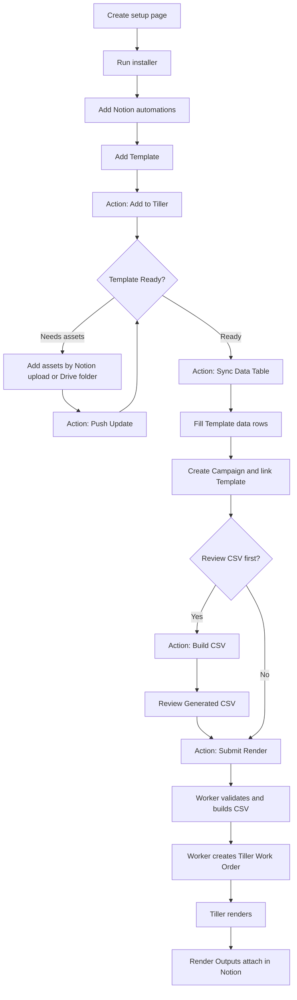
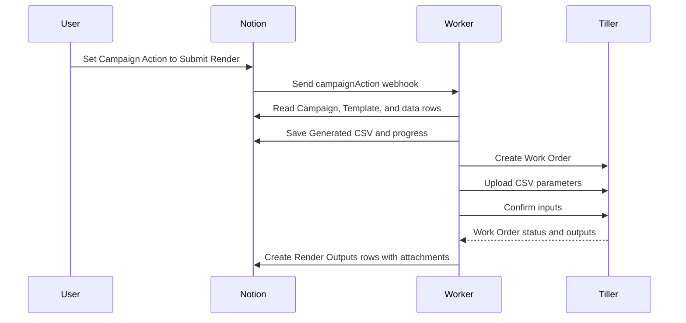

# Tiller Portal Template Guide

Use this guide as the customer-facing Notion template guide for a portable Tiller Portal. The portal lets a motion designer or studio run Tiller renders from Notion while keeping credentials in the Notion Worker environment, not in Notion pages.

## Quick Start

| Step | User Action | Result |
| --- | --- | --- |
| 1. Prepare Notion | Create one blank setup page and share it with a Notion internal integration. | Installer has a safe place to build. |
| 2. Run installer | Paste the bootstrap command in Terminal. | Portal pages, databases, Worker, and webhooks are created. |
| 3. Add automations | Add Notion database automations using webhook URLs from Settings. | Action changes can trigger Worker code. |
| 4. Add Template | Upload a Cavalry file and set `Action` to `Add to Tiller`. | Tiller returns Template details and CSV columns. |
| 5. Sync data table | Set Template `Action` to `Sync Data Table`. | Template-specific data rows database is created. |
| 6. Submit render | Link Campaign rows, then set Campaign `Action` to `Submit Render`. | Worker builds CSV, submits Work Order, and returns outputs. |

## Portal Map

| Area | Purpose | Daily Owner |
| --- | --- | --- |
| How to Use | Operating SOP and workflow map. | Everyone. |
| Campaigns | Main workspace for render jobs. | Producer, designer, or marketer. |
| Templates | Tiller template library. | Motion designer. |
| Template Data Tables | One data rows database per Template. | Person preparing campaign data. |
| Work Orders | Tiller jobs and status checks. | Motion designer or operator. |
| Render Outputs | One finished output per row. | Team reviewing final renders. |
| Uploads | Template/work-order asset tracking rows. | Operator when Tiller needs assets. |
| Settings | Webhook URLs, setup commands, support commands. | Admin/operator. |

## Workflow Map



## Setup Requirements

| Requirement | Why It Is Needed |
| --- | --- |
| Notion workspace with Workers enabled | Runs Worker tools and webhooks. |
| One blank Notion setup page | Safe parent page where installer builds the portal. |
| Notion internal integration token | Lets Worker create/read/update the portal databases. |
| Tiller email/password | Lets Worker authenticate with Tiller. |
| Node.js 22+ and npm | Runs the installer. |
| Notion CLI | Deploys the Notion Worker. |
| Optional Google Drive API key | Reads public Drive folders used for large asset sets. |
| Optional Google Drive OAuth values | Reads private Drive folders or uploads outputs to Drive. |

## Install Command

Use this for a fresh setup:

```shell
curl -fsSL https://raw.githubusercontent.com/MotionWriter/notion-tiller-portal-public/main/scripts/bootstrap.sh | bash
```

If bootstrap pauses after Notion login, run:

```shell
ntn login poll
```

Then run manual install:

```shell
npm exec --yes --package=github:MotionWriter/notion-tiller-portal-public#main -- notion-tiller-portal install
```

## Credential Model

Credentials are stored on the Notion Worker environment. They are not stored in Notion pages, Notion databases, or installer state.

| Command | Use It For | Prints Secret Values? |
| --- | --- | --- |
| `credentials` | Update Notion token, Tiller email/password, Tiller API base, fallback CSV columns. | No. |
| `google-drive` | Update Google Drive API key, OAuth values, max Drive download size. | No. |
| `secrets` | See which Worker env values are set/missing and optionally delete old values. | No. |
| `doctor` | Check local setup and Worker/Tiller health. | No. |

### Credential Commands

```shell
npm exec --yes --package=github:MotionWriter/notion-tiller-portal-public#main -- notion-tiller-portal credentials
```

```shell
npm exec --yes --package=github:MotionWriter/notion-tiller-portal-public#main -- notion-tiller-portal google-drive
```

```shell
npm exec --yes --package=github:MotionWriter/notion-tiller-portal-public#main -- notion-tiller-portal secrets
```

```shell
npm exec --yes --package=github:MotionWriter/notion-tiller-portal-public#main -- notion-tiller-portal doctor
```

## Google Drive Setup

There is no built-in Google OAuth popup yet. Current setup is manual.

| Path | Best For | User Provides | Notion Field |
| --- | --- | --- | --- |
| Public Drive folder | Large folders that can be public by link. | Google Drive API key. | `Template Assets URL` |
| Private Drive folder | Folders that should stay private. | Google client ID, client secret, refresh token. | `Template Assets URL` |
| Notion uploads | Small asset sets and simple tests. | File attachments in Upload rows. | Uploads database rows |

Useful Google links:

| Need | Link |
| --- | --- |
| Create or restrict API keys | https://console.cloud.google.com/apis/credentials |
| Enable Google Drive API | https://console.cloud.google.com/apis/library/drive.googleapis.com |
| Google Drive OAuth scopes | https://developers.google.com/workspace/drive/api/guides/api-specific-auth |
| OAuth Playground for refresh tokens | https://developers.google.com/oauthplayground |

Minimum credentials:

| Use Case | Required Value | Scope |
| --- | --- | --- |
| Public Google Drive folders | `GOOGLE_DRIVE_API_KEY` | None |
| Private Google Drive folder reads | OAuth client ID, client secret, refresh token | `https://www.googleapis.com/auth/drive.readonly` |
| Google Drive output uploads | OAuth client ID, client secret, refresh token | `https://www.googleapis.com/auth/drive.file` |

AI helper prompt:

```text
Help me create Google Drive API credentials for Notion Tiller Portal.
Purpose: allow my Notion Worker to read asset folders from Google Drive and optionally upload finished render outputs to Google Drive.
I need:
1. Google Drive API enabled in Google Cloud.
2. An API key restricted to the Google Drive API for public folder links.
3. If I need private folders or Drive output uploads, an OAuth 2.0 client ID, client secret, and refresh token.
Scopes needed:
- For private folder reads: https://www.googleapis.com/auth/drive.readonly
- For output uploads: https://www.googleapis.com/auth/drive.file
Do not ask me to paste secrets into Notion. These values will be saved through the CLI command `notion-tiller-portal google-drive`.
Walk me step by step through Google Cloud Console and OAuth Playground.
```

Mixed sources are supported. The Worker checks every pending Upload row before uploading anything. If an Upload row has a Notion attachment, the attached filename must match the expected Tiller filename for exact file paths. If an Upload row has no attachment, the Worker tries to match a file from `Template Assets URL`. It only starts uploading after every required row has a valid Notion attachment or Google Drive match.

If anything is missing or mismatched, no files are uploaded for that pass. The Uploads database becomes the punch list:

| Upload Field | What To Look For |
| --- | --- |
| `Phase` | `template_asset`, `parameter`, or `dynamic_asset`. |
| `Tiller Path` | Exact path Tiller expects. |
| `File` | Attach the matching Notion file here when not using Drive. |
| `Ready` | Checked after Worker uploads the row. |
| `Last Error` | Missing file or filename mismatch instructions. |

Campaign rows also show the punch list when a linked Work Order is blocked:

| Campaign Field | What It Does |
| --- | --- |
| `Missing Uploads` | Relation to the exact Upload rows that need files. |
| `Missing Uploads URL` | Link to the first missing Upload row for quick access. |
| `Campaign Status` | Changes to `Needs Fix` while uploads are missing. |

Use the Uploads database view `Needs Files` to see every unresolved upload across Templates and Work Orders.

Public folder flow:

1. Share the Drive folder as anyone with link can view.
2. Run the `google-drive` command.
3. Add `GOOGLE_DRIVE_API_KEY`.
4. Paste the folder link into `Template Assets URL`.
5. Set Template `Action` to `Push Update`.

Private folder flow:

1. Create Google OAuth credentials.
2. Generate a refresh token for the Drive account.
3. Run the `google-drive` command.
4. Add client ID, client secret, and refresh token.
5. Paste the folder link into `Template Assets URL`.
6. Set Template `Action` to `Push Update`.

Future ideal flow: `google-drive login` opens Google OAuth in the browser and stores the refresh token on the Worker. That is not implemented yet.

## Notion Automations

Create database automations that watch each `Action` field.

| Database | Trigger Values | Webhook |
| --- | --- | --- |
| Templates | `Add to Tiller`, `Push Update`, `Check Status`, `Sync Data Table` | `templateAction` |
| Campaigns | `Validate`, `Build CSV`, `Submit Render` | `campaignAction` |
| Work Orders | `Submit to Tiller`, `Check Status`, `Download Results` | `workOrderAction` |

For every Notion `Send webhook` action:

| Setting | Value |
| --- | --- |
| URL | Matching URL from Settings > Webhook URLs. |
| Custom headers | Leave empty. |
| Content | Select all existing properties. |

No custom JSON is needed. The Worker reads the page ID from Notion's webhook event and retrieves the full page from Notion.

## Template Workflow

| Step | Action | What Happens |
| --- | --- | --- |
| 1 | Add row in Templates. | Draft Template exists in Notion. |
| 2 | Attach Cavalry file in `Cav File`. | Worker can upload the scene to Tiller. |
| 3 | Set `Action` to `Add to Tiller`. | Worker submits Template to Tiller. |
| 4 | Watch `_Milestone`, `_Progress`, `_Progress Note`, and `Tiller Response`. | User sees status or fix instructions. |
| 5 | If pending assets, provide assets and set `Action` to `Push Update`. | Worker uploads matching missing assets. |
| 6 | When Ready, set `Action` to `Sync Data Table`. | Worker creates Template-specific data rows database. |

## Campaign Data Workflow

Every Template gets its own data rows database because every Template can require different CSV columns.

| Field Type | Naming Pattern | Meaning |
| --- | --- | --- |
| System fields | Start with `_` | Used by Notion/Worker, not exported as CSV data. |
| CSV fields | Exact Tiller CSV names | Exported into the generated CSV. |
| Relations | `_Campaign`, Template links | Connect campaign rows to render jobs. |

Required row behavior:

| Field | Required? | Notes |
| --- | --- | --- |
| `_Campaign` | Yes | Links row to the Campaign being rendered. |
| `_Include in Render` | Yes | Only checked rows render. |
| CSV columns | Depends on Template | Must match Template details from Tiller. |

## Campaign Render Workflow

| Campaign Action | Use When | Result |
| --- | --- | --- |
| `Validate` | Check data without creating a Work Order. | Errors are written to Campaign/rows. |
| `Build CSV` | Review CSV before rendering. | `Generated CSV` and `CSV Row Count` are updated. |
| `Submit Render` | Ready to render. | Worker validates, builds CSV, saves it, creates Work Order, uploads CSV, confirms inputs, and tracks outputs. |

`Submit Render` automatically builds the CSV first. Users do not need to run `Build CSV` unless they want a preview.

## Output Workflow

Render Outputs are stored one file per row.

| Field | Meaning |
| --- | --- |
| `Output File` | Finished render attached in Notion. |
| `Campaign` | Campaign that produced the output. |
| `Work Order` | Tiller Work Order that produced the output. |
| `Template` | Template used for render. |
| `Status` | Output availability or failure state. |

## Troubleshooting

| Problem | Fix |
| --- | --- |
| Template does not submit | Confirm `Cav File` is attached and `Action` is `Add to Tiller`. |
| Template pending assets | Add assets through Upload rows or `Template Assets URL`, then use `Push Update`. |
| Google Drive assets fail | Run `google-drive`, confirm folder permissions, and confirm API key/OAuth values are set. |
| Upload rows show filename mismatch | Attach a file whose filename matches the expected `Tiller Path` basename, or fix the Drive folder file name. |
| Campaign cannot build CSV | Confirm Template has synced data table, rows link `_Campaign`, and `_Include in Render` is checked. |
| Render does not start | Check Campaign `Last Error`, `_Milestone`, `_Progress Note`, then run `doctor`. |
| Tiller auth fails | Run `credentials` and update Tiller email/password. |
| Need to know what is configured | Run `secrets`; it shows set/missing only, not values. |
| Outputs do not attach | Open Work Orders and use `Check Status` or `Download Results`. |

## Safety Rules

| Rule | Reason |
| --- | --- |
| Do not store passwords in Notion. | Credentials belong in Worker env only. |
| Use public Drive folders only when sharing is acceptable. | Anyone with link can access them. |
| Use OAuth for private Drive folders. | Keeps private assets behind account access. |
| Keep one data table per Template. | CSV schemas vary by Template. |
| Use `Build CSV` for first tests. | Easier to catch field mismatch before rendering. |
| Use `Submit Render` for normal work. | It builds CSV automatically before submission. |

## First Render Checklist

| Done | Item |
| --- | --- |
|  | Installer completed. |
|  | Webhook URLs saved in Settings. |
|  | Notion automations created. |
|  | `doctor` passes. |
|  | Template added to Tiller. |
|  | Template status is `Ready`. |
|  | Template data table synced. |
|  | Campaign created and linked to Template. |
|  | Data rows linked to `_Campaign`. |
|  | `_Include in Render` checked on rows. |
|  | `Build CSV` reviewed or `Submit Render` run. |

## First Render Sequence


